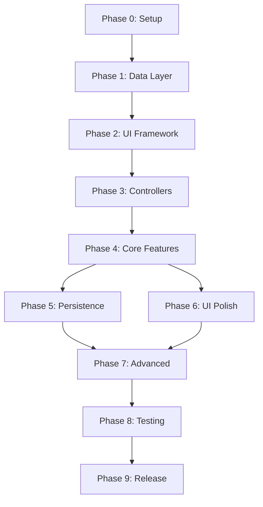

# Terminal Todo Manager - Implementation Plan

## Executive Summary

This document provides a detailed, phase-by-phase implementation strategy for building the Terminal Todo Manager application. Each phase includes specific objectives, deliverables, file creation order, and potential challenges with mitigation strategies.

## Phase 0: Project Setup and Foundation (Day 1-2)

### Objectives
- Initialize project with proper TypeScript configuration
- Set up development environment
- Establish code quality tools
- Create basic project structure

### Implementation Steps

#### Step 1: Initialize Project
```bash
mkdir todo-manager
cd todo-manager
npm init -y
git init
```

#### Step 2: Install Core Dependencies
```bash
# Core dependencies
npm install blessed neo-blessed chalk commander uuid date-fns

# TypeScript and development tools
npm install -D typescript @types/node @types/blessed
npm install -D ts-node nodemon eslint prettier
npm install -D @typescript-eslint/parser @typescript-eslint/eslint-plugin
npm install -D jest @types/jest ts-jest
```

#### Step 3: Create Configuration Files

**tsconfig.json**
```json
{
  "compilerOptions": {
    "target": "ES2022",
    "module": "commonjs",
    "lib": ["ES2022"],
    "outDir": "./dist",
    "rootDir": "./src",
    "strict": true,
    "esModuleInterop": true,
    "skipLibCheck": true,
    "forceConsistentCasingInFileNames": true,
    "resolveJsonModule": true,
    "declaration": true,
    "declarationMap": true,
    "sourceMap": true,
    "noUnusedLocals": true,
    "noUnusedParameters": true,
    "noImplicitReturns": true,
    "noFallthroughCasesInSwitch": true
  },
  "include": ["src/**/*"],
  "exclude": ["node_modules", "dist", "tests"]
}
```

**package.json scripts**
```json
{
  "scripts": {
    "dev": "nodemon --watch src --exec ts-node src/index.ts",
    "build": "tsc",
    "start": "node dist/index.js",
    "test": "jest",
    "test:watch": "jest --watch",
    "lint": "eslint src/**/*.ts",
    "format": "prettier --write src/**/*.ts"
  }
}
```

#### Step 4: Create Initial Directory Structure
```bash
mkdir -p src/{models,views,controllers,services,utils,types,config}
mkdir -p src/views/components
mkdir -p tests/{unit,integration,e2e}
mkdir -p data config themes docs
```

### Deliverables
- ✅ Initialized Git repository
- ✅ Configured TypeScript environment
- ✅ Development tools setup
- ✅ Basic directory structure

### Potential Challenges
- **Challenge**: Blessed type definitions may be incomplete
- **Solution**: Create custom type declarations in `src/types/blessed.d.ts`

---

## Phase 1: Core Data Layer (Day 3-5)

### Objectives
- Implement core data models
- Set up database abstraction
- Create basic CRUD operations
- Establish data validation

### File Creation Order

#### Step 1: Define TypeScript Interfaces
**src/types/models.ts**
```typescript
export enum TodoStatus {
  ACTIVE = 'active',
  PENDING = 'pending',
  COMPLETED = 'completed',
  ARCHIVED = 'archived'
}

export enum Priority {
  LOW = 'low',
  MEDIUM = 'medium',
  HIGH = 'high',
  CRITICAL = 'critical'
}

export interface ITodoItem {
  id: string;
  title: string;
  description?: string;
  status: TodoStatus;
  priority: Priority;
  projectId?: string;
  tags: string[];
  dueDate?: Date;
  createdAt: Date;
  updatedAt: Date;
  completedAt?: Date;
}

export interface IProject {
  id: string;
  name: string;
  description?: string;
  color: string;
  parentId?: string;
  orderIndex: number;
  isArchived: boolean;
  createdAt: Date;
}
```

#### Step 2: Implement Database Service
**src/services/DatabaseService.ts**
```typescript
// Start with JSON storage, prepare for SQLite migration
export class DatabaseService {
  private dataPath: string;
  
  constructor() {
    this.dataPath = './data/todos.json';
    this.initializeDatabase();
  }
  
  private async initializeDatabase(): Promise<void> {
    // Create data file if not exists
  }
  
  async save(collection: string, data: any): Promise<void> {
    // Implementation
  }
  
  async load(collection: string): Promise<any> {
    // Implementation
  }
}
```

#### Step 3: Create Model Classes
**src/models/BaseModel.ts**
```typescript
export abstract class BaseModel<T> {
  protected db: DatabaseService;
  
  constructor(db: DatabaseService) {
    this.db = db;
  }
  
  abstract create(data: Partial<T>): Promise<T>;
  abstract update(id: string, data: Partial<T>): Promise<T>;
  abstract delete(id: string): Promise<boolean>;
  abstract findById(id: string): Promise<T | null>;
  abstract findAll(): Promise<T[]>;
}
```

**src/models/TodoModel.ts**
```typescript
export class TodoModel extends BaseModel<ITodoItem> {
  // Implement CRUD operations
}
```

### Testing Strategy
```typescript
// tests/unit/models/TodoModel.test.ts
describe('TodoModel', () => {
  test('should create a new todo item', async () => {
    // Test implementation
  });
  
  test('should validate required fields', async () => {
    // Test implementation
  });
});
```

### Deliverables
- ✅ Type definitions for all entities
- ✅ Database service with JSON storage
- ✅ Model classes with CRUD operations
- ✅ Unit tests for models

### Potential Challenges
- **Challenge**: Handling concurrent data access
- **Solution**: Implement file locking mechanism or queue system
- **Challenge**: Data migration when switching to SQLite
- **Solution**: Create migration scripts and versioning system

---

## Phase 2: Basic Terminal UI Framework (Day 6-9)

### Objectives
- Set up Blessed screen management
- Create base view classes
- Implement panel layout system
- Establish event handling

### File Creation Order

#### Step 1: Create Base View Class
**src/views/BaseView.ts**
```typescript
import * as blessed from 'blessed';

export abstract class BaseView {
  protected screen: blessed.Widgets.Screen;
  protected container: blessed.Widgets.BoxElement;
  protected focused: boolean = false;
  
  constructor(screen: blessed.Widgets.Screen, options: any) {
    this.screen = screen;
    this.container = this.createContainer(options);
    this.setupEventHandlers();
  }
  
  abstract createContainer(options: any): blessed.Widgets.BoxElement;
  abstract render(): void;
  abstract setupEventHandlers(): void;
  
  focus(): void {
    this.focused = true;
    this.container.focus();
  }
  
  blur(): void {
    this.focused = false;
  }
}
```

#### Step 2: Implement Main Application View
**src/views/MainView.ts**
```typescript
export class MainView {
  private screen: blessed.Widgets.Screen;
  private layout: blessed.Widgets.LayoutElement;
  
  constructor() {
    this.screen = blessed.screen({
      smartCSR: true,
      title: 'Terminal Todo Manager'
    });
    
    this.createLayout();
    this.setupGlobalKeys();
  }
  
  private createLayout(): void {
    // Create multi-panel layout
  }
  
  private setupGlobalKeys(): void {
    this.screen.key(['q', 'C-c'], () => {
      process.exit(0);
    });
  }
}
```

#### Step 3: Create Individual Panel Views
**src/views/TodoListView.ts**
```typescript
export class TodoListView extends BaseView {
  private list: blessed.Widgets.ListElement;
  private todos: ITodoItem[] = [];
  
  createContainer(options: any): blessed.Widgets.BoxElement {
    // Create list container with sections
  }
  
  render(): void {
    // Render todo items in list
  }
  
  setupEventHandlers(): void {
    // Handle selection, scrolling, etc.
  }
}
```

### Testing Strategy
- Manual testing with different terminal sizes
- Mock blessed components for unit tests
- Visual regression testing with screenshots

### Deliverables
- ✅ Base view architecture
- ✅ Main application screen
- ✅ Basic panel layout
- ✅ Keyboard navigation foundation

### Potential Challenges
- **Challenge**: Blessed rendering issues across terminals
- **Solution**: Test on multiple terminal emulators, create compatibility layer
- **Challenge**: Complex layout management
- **Solution**: Use blessed-contrib for advanced layouts if needed

---

## Phase 3: Controller Layer and State Management (Day 10-12)

### Objectives
- Implement MVC controller pattern
- Create state management system
- Connect views to models
- Handle user interactions

### File Creation Order

#### Step 1: Create Event Emitter System
**src/utils/EventBus.ts**
```typescript
import { EventEmitter } from 'events';

export enum AppEvents {
  TODO_CREATED = 'todo:created',
  TODO_UPDATED = 'todo:updated',
  TODO_DELETED = 'todo:deleted',
  VIEW_CHANGED = 'view:changed',
  FILTER_APPLIED = 'filter:applied'
}

class EventBus extends EventEmitter {
  private static instance: EventBus;
  
  static getInstance(): EventBus {
    if (!EventBus.instance) {
      EventBus.instance = new EventBus();
    }
    return EventBus.instance;
  }
}

export default EventBus.getInstance();
```

#### Step 2: Implement Controllers
**src/controllers/BaseController.ts**
```typescript
export abstract class BaseController {
  protected eventBus: EventEmitter;
  
  constructor() {
    this.eventBus = EventBus;
    this.registerEventHandlers();
  }
  
  abstract registerEventHandlers(): void;
}
```

**src/controllers/TodoController.ts**
```typescript
export class TodoController extends BaseController {
  private todoModel: TodoModel;
  private todoListView: TodoListView;
  
  constructor(model: TodoModel, view: TodoListView) {
    super();
    this.todoModel = model;
    this.todoListView = view;
  }
  
  async createTodo(data: Partial<ITodoItem>): Promise<void> {
    const todo = await this.todoModel.create(data);
    this.eventBus.emit(AppEvents.TODO_CREATED, todo);
  }
  
  registerEventHandlers(): void {
    this.eventBus.on(AppEvents.TODO_CREATED, (todo) => {
      this.todoListView.addTodo(todo);
    });
  }
}
```

#### Step 3: Create Application Controller
**src/controllers/AppController.ts**
```typescript
export class AppController {
  private mainView: MainView;
  private todoController: TodoController;
  private navigationController: NavigationController;
  
  async initialize(): Promise<void> {
    // Initialize models
    // Initialize views
    // Connect controllers
    // Start application
  }
  
  run(): void {
    this.mainView.render();
  }
}
```

### Deliverables
- ✅ Event-driven architecture
- ✅ Controller implementations
- ✅ Model-View binding
- ✅ State synchronization

### Potential Challenges
- **Challenge**: Complex state synchronization
- **Solution**: Implement unidirectional data flow
- **Challenge**: Memory leaks from event listeners
- **Solution**: Proper cleanup in component lifecycle

---

## Phase 4: Core Features Implementation (Day 13-17)

### Objectives
- Implement CRUD operations UI
- Add keyboard shortcuts
- Create command system
- Implement search and filter

### Implementation Priority

#### Priority 1: Basic CRUD Operations
1. Create todo via input bar
2. Display todos in list
3. Edit todo inline
4. Delete todo with confirmation
5. Mark todo as complete

#### Priority 2: Navigation and Shortcuts
1. Panel switching with Tab
2. List navigation with j/k
3. Quick actions with single keys
4. Command mode with ':'
5. Search mode with '/'

#### Priority 3: Project Management
1. Create/edit projects
2. Assign todos to projects
3. Project tree navigation
4. Project filtering

#### Priority 4: Advanced Features
1. Tags system
2. Priority indicators
3. Due date management
4. Search and filtering
5. Sorting options

### File Creation Order

**src/controllers/CommandController.ts**
```typescript
export class CommandController {
  private commands: Map<string, CommandHandler>;
  
  constructor() {
    this.registerCommands();
  }
  
  private registerCommands(): void {
    this.commands.set('new', this.handleNew);
    this.commands.set('delete', this.handleDelete);
    this.commands.set('filter', this.handleFilter);
    // More commands...
  }
  
  async execute(input: string): Promise<void> {
    const [command, ...args] = input.split(' ');
    const handler = this.commands.get(command);
    if (handler) {
      await handler(args);
    }
  }
}
```

### Testing Strategy
```typescript
// tests/integration/features.test.ts
describe('Core Features', () => {
  test('should create todo from command', async () => {
    // Test command execution
  });
  
  test('should filter todos by project', async () => {
    // Test filtering
  });
});
```

### Deliverables
- ✅ Full CRUD functionality
- ✅ Keyboard navigation
- ✅ Command system
- ✅ Search and filter
- ✅ Project management

---

## Phase 5: Data Persistence and Settings (Day 18-20)

### Objectives
- Migrate to SQLite database
- Implement configuration management
- Add import/export functionality
- Create backup system

### Implementation Steps

#### Step 1: SQLite Migration
**src/services/SQLiteService.ts**
```typescript
import Database from 'better-sqlite3';

export class SQLiteService {
  private db: Database.Database;
  
  constructor(dbPath: string) {
    this.db = new Database(dbPath);
    this.initializeTables();
  }
  
  private initializeTables(): void {
    const createTodosTable = `
      CREATE TABLE IF NOT EXISTS todos (
        id TEXT PRIMARY KEY,
        title TEXT NOT NULL,
        description TEXT,
        status TEXT NOT NULL,
        priority TEXT NOT NULL,
        project_id TEXT,
        tags TEXT,
        due_date TEXT,
        created_at TEXT NOT NULL,
        updated_at TEXT NOT NULL,
        completed_at TEXT
      )
    `;
    
    this.db.exec(createTodosTable);
    // Create other tables...
  }
}
```

#### Step 2: Configuration Service
**src/services/ConfigService.ts**
```typescript
export class ConfigService {
  private configPath: string;
  private config: AppConfig;
  
  constructor() {
    this.configPath = './config/user-config.json';
    this.loadConfig();
  }
  
  loadConfig(): void {
    // Load or create default config
  }
  
  saveConfig(): void {
    // Save configuration changes
  }
  
  get<K extends keyof AppConfig>(key: K): AppConfig[K] {
    return this.config[key];
  }
  
  set<K extends keyof AppConfig>(key: K, value: AppConfig[K]): void {
    this.config[key] = value;
    this.saveConfig();
  }
}
```

### Deliverables
- ✅ SQLite database implementation
- ✅ Data migration from JSON
- ✅ Configuration management
- ✅ Import/export functionality
- ✅ Automatic backups

---

## Phase 6: UI Polish and Enhancements (Day 21-23)

### Objectives
- Implement themes
- Add visual indicators
- Improve responsive layout
- Add animations and transitions

### Implementation Areas

#### Theme System
**src/services/ThemeService.ts**
```typescript
export class ThemeService {
  private currentTheme: Theme;
  
  applyTheme(themeName: string): void {
    // Load and apply theme
  }
  
  getColor(element: string): string {
    return this.currentTheme.colors[element];
  }
}
```

#### Visual Enhancements
1. Priority color coding
2. Progress indicators
3. Status badges
4. Overdue highlights
5. Selection indicators

#### Responsive Layout
1. Dynamic panel sizing
2. Minimum size constraints
3. Collapsible panels
4. Adaptive content display

### Deliverables
- ✅ Theme system with multiple themes
- ✅ Visual indicators and badges
- ✅ Responsive layout
- ✅ Smooth transitions

---

## Phase 7: Advanced Features (Day 24-27)

### Objectives
- Implement recurring tasks
- Add subtasks support
- Create smart lists
- Add undo/redo system

### Implementation Priority

1. **Undo/Redo System**
   - Command pattern implementation
   - History stack management
   - Keyboard shortcuts (Ctrl+Z/Y)

2. **Recurring Tasks**
   - Recurrence rule parser
   - Task generation logic
   - Exception handling

3. **Subtasks**
   - Nested task structure
   - Progress calculation
   - UI representation

4. **Smart Lists**
   - Today view
   - Week view
   - Overdue items
   - Recently completed

### File Creation
**src/services/UndoRedoService.ts**
```typescript
export class UndoRedoService {
  private undoStack: Command[] = [];
  private redoStack: Command[] = [];
  
  execute(command: Command): void {
    command.execute();
    this.undoStack.push(command);
    this.redoStack = [];
  }
  
  undo(): void {
    const command = this.undoStack.pop();
    if (command) {
      command.undo();
      this.redoStack.push(command);
    }
  }
}
```

### Deliverables
- ✅ Recurring tasks
- ✅ Subtasks management
- ✅ Smart lists
- ✅ Undo/redo functionality

---

## Phase 8: Testing and Optimization (Day 28-30)

### Objectives
- Comprehensive test coverage
- Performance optimization
- Memory leak detection
- Bug fixes

### Testing Strategy

#### Unit Tests (80% coverage target)
```bash
tests/unit/
├── models/
├── controllers/
├── services/
└── utils/
```

#### Integration Tests
```bash
tests/integration/
├── crud-operations.test.ts
├── navigation.test.ts
├── command-system.test.ts
└── data-persistence.test.ts
```

#### E2E Tests
```bash
tests/e2e/
├── user-workflows.test.ts
├── keyboard-navigation.test.ts
└── data-integrity.test.ts
```

### Performance Optimization

1. **Virtual Scrolling**
   - Implement for lists > 100 items
   - Render only visible items

2. **Debouncing**
   - Search operations (300ms)
   - Save operations (1000ms)
   - Filter updates (200ms)

3. **Caching**
   - Computed properties
   - Filter results
   - Search indices

4. **Memory Management**
   - Event listener cleanup
   - Reference clearing
   - Garbage collection optimization

### Deliverables
- ✅ Test coverage > 80%
- ✅ Performance benchmarks met
- ✅ Memory leaks fixed
- ✅ Bug fixes completed

---

## Phase 9: Documentation and Release (Day 31-32)

### Objectives
- Complete documentation
- Create user guide
- Package for distribution
- Set up CI/CD

### Documentation Structure

```
docs/
├── API.md           # API documentation
├── USER-GUIDE.md    # User manual
├── DEVELOPER.md     # Developer guide
├── SHORTCUTS.md     # Keyboard shortcuts reference
└── CHANGELOG.md     # Version history
```

### Release Preparation

1. **Build Configuration**
   ```json
   {
     "build": {
       "targets": ["node14-linux-x64", "node14-macos-x64", "node14-win-x64"]
     }
   }
   ```

2. **Distribution**
   - npm package
   - GitHub releases
   - Homebrew formula (macOS)
   - Snap package (Linux)

### Deliverables
- ✅ Complete documentation
- ✅ User guide with examples
- ✅ Distribution packages
- ✅ CI/CD pipeline

---

## Critical Path and Dependencies



## Risk Mitigation Strategies

### Technical Risks

| Risk | Probability | Impact | Mitigation |
|------|------------|--------|------------|
| Blessed limitations | High | High | Early prototype, fallback to alternative libraries |
| SQLite performance | Medium | Medium | Implement caching, pagination, indexing |
| Cross-platform issues | High | Low | Test on multiple OS/terminals early |
| Memory leaks | Medium | High | Regular profiling, automated testing |
| Complex state management | Medium | Medium | Strict unidirectional data flow |

### Schedule Risks

| Risk | Mitigation |
|------|------------|
| Feature creep | Strict MVP definition, defer nice-to-haves |
| Integration issues | Continuous integration from Phase 2 |
| Testing delays | Test-driven development approach |
| Documentation lag | Document as you code |

## Success Metrics

### Phase Completion Criteria

Each phase is considered complete when:
1. All deliverables are implemented
2. Unit tests pass (where applicable)
3. Integration tests pass (where applicable)
4. Documentation is updated
5. Code review completed

### Project Success Criteria

1. **Functional**
   - All core features working
   - < 5 critical bugs in production
   - Performance targets met

2. **Quality**
   - Test coverage > 80%
   - ESLint zero errors
   - TypeScript strict mode compliance

3. **Usability**
   - Intuitive keyboard navigation
   - Response time < 100ms for most operations
   - Clear visual feedback

4. **Maintainability**
   - Modular architecture
   - Comprehensive documentation
   - Clean code principles

## Development Tools and Practices

### Recommended VSCode Extensions
```json
{
  "recommendations": [
    "dbaeumer.vscode-eslint",
    "esbenp.prettier-vscode",
    "ms-vscode.vscode-typescript-tslint-plugin",
    "orta.vscode-jest",
    "wayou.vscode-todo-highlight"
  ]
}
```

### Git Workflow

1. **Branch Strategy**
   - `main`: Production-ready code
   - `develop`: Integration branch
   - `feature/*`: Feature branches
   - `bugfix/*`: Bug fix branches

2. **Commit Convention**
   ```
   type(scope): subject
   
   Types: feat, fix, docs, style, refactor, test, chore
   ```

### Code Review Checklist

- [ ] TypeScript types properly defined
- [ ] Error handling implemented
- [ ] Unit tests written
- [ ] Documentation updated
- [ ] No console.log statements
- [ ] Memory leaks checked
- [ ] Performance impact assessed

## Conclusion

This implementation plan provides a structured approach to building the Terminal Todo Manager. By following these phases sequentially, you'll build a solid foundation and progressively add features while maintaining code quality and stability.

### Key Success Factors

1. **Start Simple**: Begin with basic functionality and iterate
2. **Test Early**: Write tests as you develop features
3. **Document Continuously**: Keep documentation up-to-date
4. **Refactor Regularly**: Maintain code quality throughout
5. **User Feedback**: Test with real users after Phase 4

### Next Steps

1. Complete Phase 0 setup
2. Create initial prototype with Phases 1-3
3. Validate UI/UX approach
4. Iterate based on feedback
5. Complete remaining phases

Remember: The plan is flexible. Adjust based on discoveries during implementation, but maintain the core architecture and quality standards.